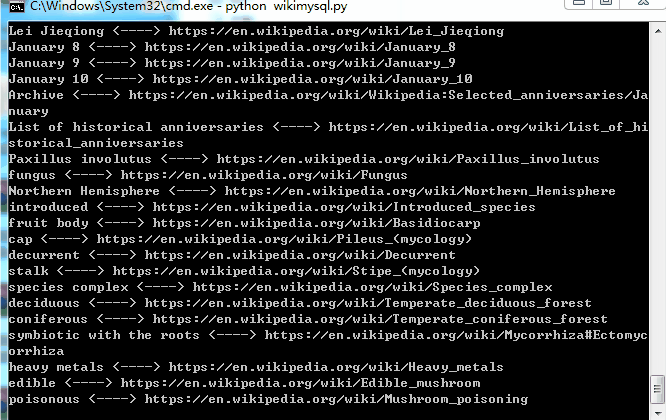
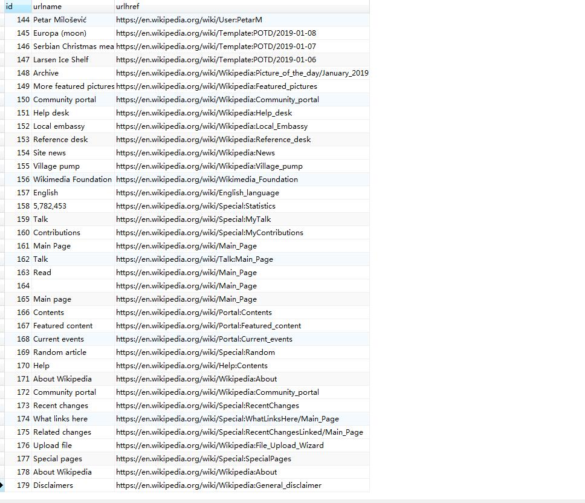

# Python-wikimysql
python数据采集案例，使用urllib和BeautifulSoup采集维基百科词条，并保存mysql数据库

## 运行环境  
* python3  
* urllib  
* BeautifulSoup  
* pymysql  

## 运行项目  
先切换到Python-wikimysql文件夹，输入以下命令运行项目    
```python      
python wiki.py       #可采集维基百科词条数据  
python wikimysql.py  #采集维基百科词条数据并保存mysql中
python readmysql.py  #可读取已经保存mysql中数据
```
## 项目预览  
  
  

## 项目说明  
1.对项目进行mysql操作之前，请确保已经安装了pymsql  
2.创建mysql数据库`wikiurl`创建数据表`urls`  
3.使用分布式多线程爬虫，会对改服务器造成一定的负荷，请自觉维护公益网站，合理安装采集时间   
4.robots.txt爬虫协议  
* User-agent:表示指定爬虫*为通配符  
* Disallow:不允许访问  
* Allow:允许访问  
